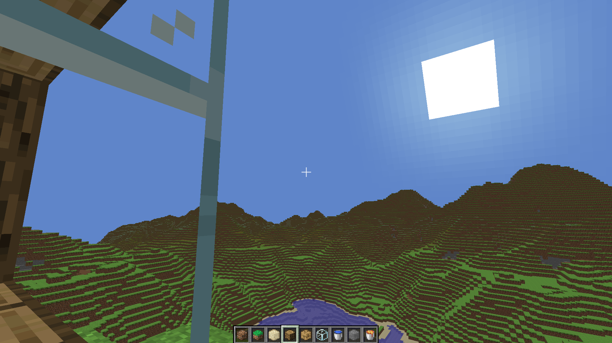

**Voxel Engine**

In this Minecraft inspired Voxel Engine you can explore an infinite procedurally generated world, including caves, oceans and a dynamic day/night cycle.  
Project is compatible with both Windows and Raspberry Pi

---

#### Features

- Smooth Movement that is identical to Minecraft
- Place and destroy blocks to build anything you want
- Fully Functional Hotbar
- Game Modes: Survival and Creative
- Procedural Cave System
- Day and Night Cycle
- Oceans
- Transparent blocks like Glass and Water
- Background Music and SFX
- A broad ImGui Debug Menu that allows you to tweak features in real time
- Compatible on both Windows and the Raspberry Pi

#### Credits

Everything in SharedItems (/Common/SharedItems) is created by Kevin Pladdet, except miniaudio.h and FastNoiseLite.h

SFX and Textures are from [Minecraft](https://www.minecraft.net/en-us/about-minecraft)

Template is created and provided by BUAS

#### Dependencies

imgui can be downladed at https://github.com/ocornut/imgui  
miniaudio.h can be downloaded at https://miniaud.io/  
FastNoiseLite.h can be downloaded at https://github.com/Auburn/FastNoiseLite  
stb_image.h can be downloaded at https://github.com/nothings/stb/blob/master/stb_image.h